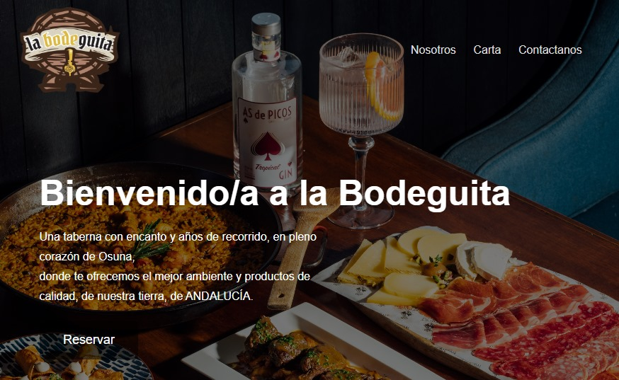
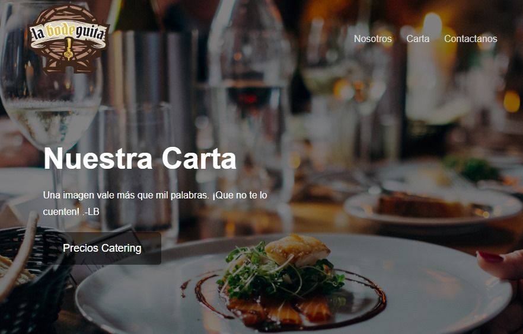
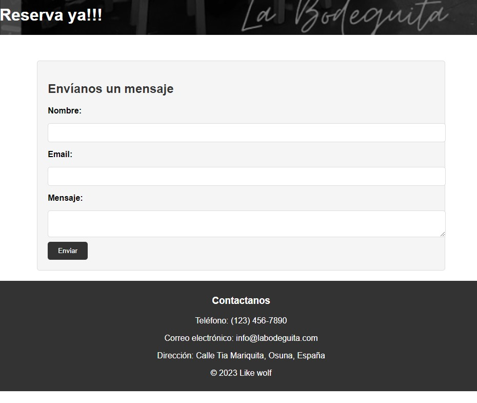

 # La Bodeguita🍺

En el corazón de la pintoresca región de Andalucía, en el sur de España, se encuentra una pequeña bodeguita. Esta bodeguita se ubica en el encantador pueblo de osuna, donde la tradición, la pasión y la cultura se entrelazan en cada rincón.

## Contenido📚

- [Introducción](#introducción)
- [Características](#características)
- [Tecnologías](#tecnologías-utilizadas) 
- [Agradecimiento](#agradecimientos)
- [Algunos Errores](#algunos-errores)
- [Captura de Pantalla](#capturas-de-pantalla)
 
 

## Introducción

Este ha sido mi primer proyecto durante mi formación como desarrollador Full Stack en GeeksHubs Academy; La Bodeguita, es el bar donde trabajo de hace un tiempo ya, el cual me ha dado momentos de emocion y tambien de locura, sin embargo, el trabajo o servicio que damos a los clientes a diario, es el mejor que se puede encontrar en el pueblo donde vivo, por eso traigo para este primer proyecto, el desarrollo de una pagina web, con los elementos mas basicos, y buscar el crecimiento en las redes sociales para la bodeguita, asi seguir incentivando el turismo en Osuna, y el interes por la buena comida que aqui servimos.

## Características

En esta WEB podremos ver tres pestañas. La primera, es el home, donde nos da la bienvenida con una imagen que muestra un poco la comida tipica de andalucia. Mientras vamos bajando nos encontramos un apartado donde habla un poco sobre la historia del bar, hasta llegar al apartado que nos facilita la informacion de contacto y ubicacion del mismo.

En la segunda pestaña, nos encontramos con la carta y posibilidades para solicitar presupuesto para catering.

Y para terminar, la tercera pestaña aporta información de contacto para el cliente, además, incluye un formulario donde el cliente podrá reservar.

## Tecnologías Utilizadas

 
 

## Agradecimientos

Agradecimientos especiales a mi profesor David Ochando por su entrega y dedicación a la hora de formarnos en esta nueva aventura que es la programación.

## Algunos Errores

Algunos errores que no he podido solucionar es esta primera edición de este proyecto son: 

- Hacerlo responsive.
- Las imágenes del menú tampoco se han podido ajustar a la caja contenedora.

## Capturas de Pantalla

